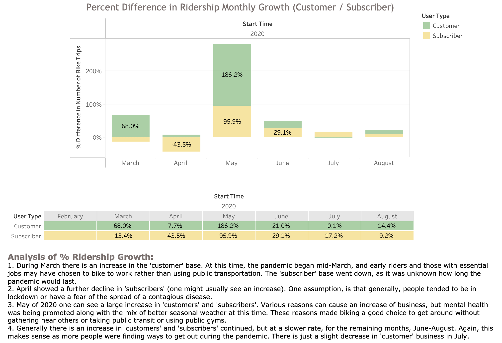
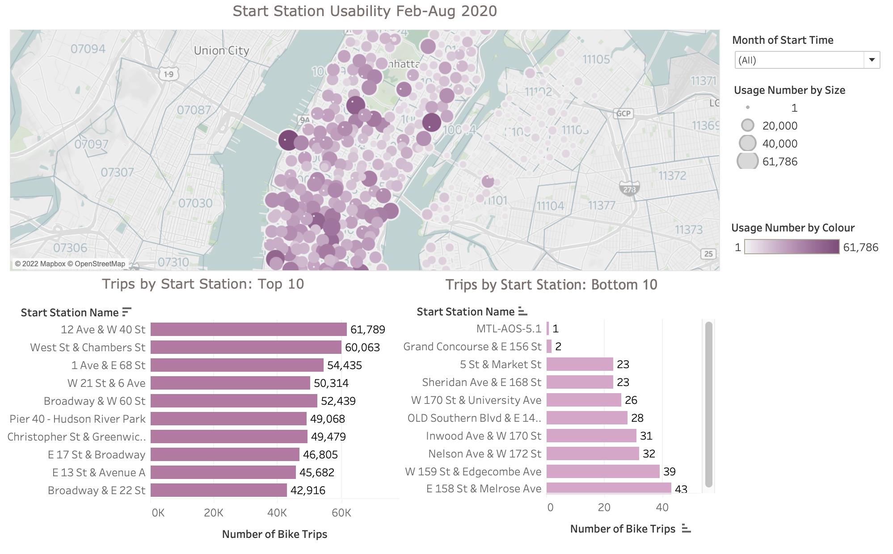

# Citi Bike Analytics
Aggregated the data found in the Citi Bike Trip History Logs, create visualizations and analyzed the data.

### Before Beginning

* Be sure to create a Tableau Public account [here](https://public.tableau.com/s/).

* The free tier of Tableau only lets you save to their public server. This means that each time you save your file it will be uploaded to your Tableau Public profile. 

### Tableau URL and Findings 

* Saved in Tableau Public account rather than GitHub. 
[Citi Bike Analytics](https://public.tableau.com/app/profile/sherry.kennedy/viz/CitiBikeAnalyticsFebToAug2020/CitiBikeAnalyticsFebAug2020).

* Additional files used for your analysis: 
1. Analysis is within the workbook as seen on the public account link provided.
2. 'Results PDF' folder contains an additional PDF file showing images and analysis.
3. The tableau workbook and csv files are too large for github.

## Background

Congratulations on your new job! As the new lead analyst for the [New York Citi Bike](https://en.wikipedia.org/wiki/Citi_Bike) Program, you are now responsible for overseeing the largest bike sharing program in the United States. In your new role, you will be expected to generate regular reports for city officials looking to publicize and improve the city program.

Since 2013, the Citi Bike Program has implemented a robust infrastructure for collecting data on the program's utilization. Through the team's efforts, each month bike data is collected, organized, and made public on the [Citi Bike Data](https://www.citibikenyc.com/system-data) webpage.

However, while the data has been regularly updated, the team has yet to implement a dashboard or sophisticated reporting process. City officials have a number of questions on the program, so your first task on the job is to build a set of data reports to provide the answers.

## Task

**Your task in this assignment is to aggregate the data found in the Citi Bike Trip History Logs and find two unexpected phenomena.** 

**Design 2-5 visualizations for each discovered phenomena (4-10 total). You may work with a timespan of your choosing. Optionally, you may merge multiple datasets from different periods.** 

**The following are some questions you may wish to tackle. Do not limit yourself to these questions; they are suggestions for a starting point. Be creative!**

* How many trips have been recorded total during the chosen period?

* By what percentage has total ridership grown?

* How has the proportion of short-term customers and annual subscribers changed?

* What are the peak hours in which bikes are used during summer months?

* What are the peak hours in which bikes are used during winter months?

* Today, what are the top 10 stations in the city for starting a journey? (Based on data, why do you hypothesize these are the top locations?)

* Today, what are the top 10 stations in the city for ending a journey? (Based on data, why?)

* Today, what are the bottom 10 stations in the city for starting a journey? (Based on data, why?)

* Today, what are the bottom 10 stations in the city for ending a journey (Based on data, why?)

**Next, as a chronic over-achiever:**

* Use your visualizations (does not have to be all of them) to design a dashboard for each phenomena.
* The dashboards should be accompanied with an analysis explaining why the phenomena may be occuring. 

**City officials would also like to see one of the following visualizations:**

* **Basic:** A static map that plots all bike stations with a visual indication of the most popular locations to start and end a journey with zip code data overlaid on top.

* **Advanced:** A dynamic map that shows how each station's popularity changes over time (by month and year). Again, with zip code data overlaid on the map.

* The map you choose should also be accompanied by a write-up unveiling any trends that were noticed during your analysis.

**Finally, created a  final presentation**

* Create a Tableau story that brings together the visualizations, requested maps, and dashboards.
* This is what will be presented to the officials, so be sure to make it professional, logical, and visually appealing. 

## Submission 

Your final submission should include:

* A link to your Tableau Public workbook that includes: 
  * 4-10 Total "Phenomenon" Visualizations 
  * 2 Dashboards
  * 1 City Official Map
  * 1 Story 
* A text or markdown file with your analysis on the phenomenons you uncovered from the data.

# This Submission includes the following:
## Ridership Growth

## Start Stations

## Again review full analytics:
[Citi Bike Analytics Tableau](https://public.tableau.com/app/profile/sherry.kennedy/viz/CitiBikeAnalyticsFebToAug2020/CitiBikeAnalyticsFebAug2020)

[Citi Bike Analytics PDF](https://github.com/SherryKennedy/Citi_Bike_Analysis/tree/main/Results%20PDF)

- - -

© 2021 Trilogy Education Services, LLC, a 2U, Inc. brand. Confidential and Proprietary. All Rights Reserved.

